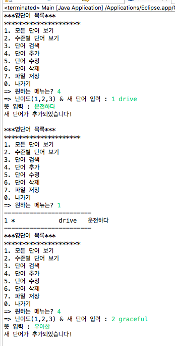
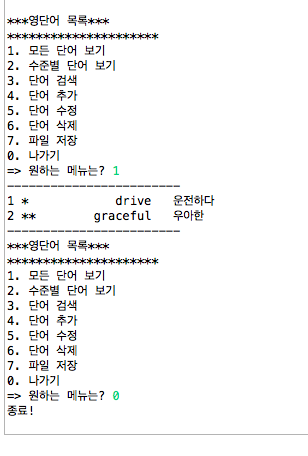
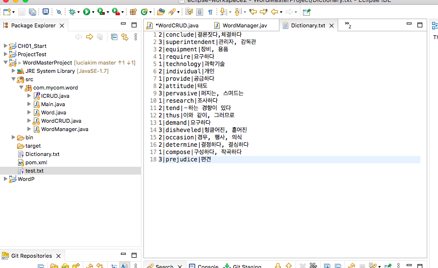
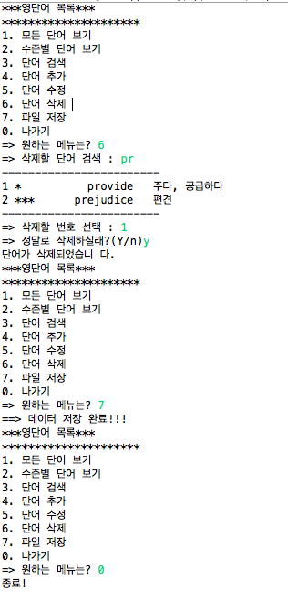
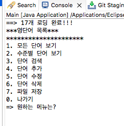

# Project1.-Java-CRUD-project-with-file-I-O

실행결과:     
</img> 
</img> 

(2단계 9/17 추가)

수준별 단어 보기:   
</img> 

단어 검색:   
</img> 

단어 수정:   
</img> 

단어 삭제:   
</img> 

파일 저장:   
</img> 

새 데이터 파일(test.txt):   
</img> 

데이터 파일 로드 테스트(Dictionary.txt) - 삭제 후 단어 수 변경 확인 가능:   
</img> 
</img> 

+ java 파일 외 상위 문서 전체 포함
<https://github.com/Lucia2135/Project1.-Java-CRUD-project.git>
